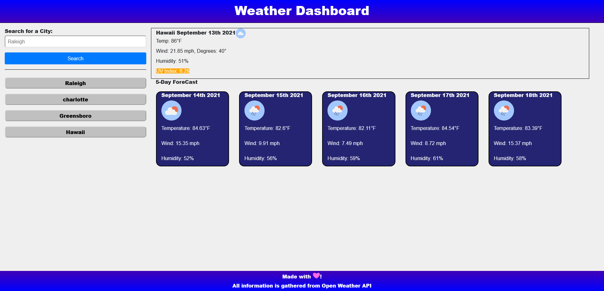

# Weather_Dashboard

## Description

This weather dashboard allows you to checkout any city in the world and see its current and future weather! It shows the temperature, a picture of the current weather there, wind conditions and direction, humidity levels, and even the UV index with a color tied to it showing its intensity.  

Below this information is a 5 day forecast of the weather to come also showing the dates, a weather icon for what the day should expect, the temperature, wind, and humidity. This should be helpful for anyone planning out their day or even planning to visit for a vacation!  

Every city you search will be saved in the local storage and will add a button on the search bar showing the city, you can then click it to re-display its info.

## URLs

GitHub repository: https://github.com/ajlineb/Weather_Dashboard

Webpage: https://ajlineb.github.io/Weather_Dashboard/

## Usage

To use the website, simply start by typing in a city that you know of, especially one you live in or want to go visit! Press enter or click the search button to get results. If you want to view any previous cities you searched they are conveniently saved below the search bar for easy quick access.

## Images

## Credits

All information gathered is from Open Weather API

## License

No licenses